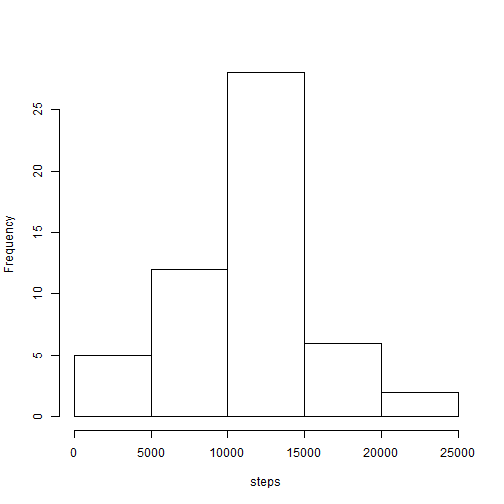
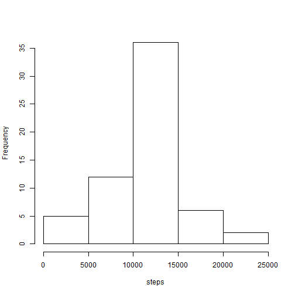

Reproducible Research: Peer Assessment 1
=============================


## Loading and preprocessing the data

First, we load the file. The zip file is assumed to be in the working directory.

```r
unzip("activity.zip")
activity <- read.csv("activity.csv")
```

## What is mean total number of steps taken per day?

Here, we remove missing values from the data, calculate the total number of steps per day, and make a histogram of the resulting data.

```r
library(dplyr)
day.total <- activity %>%
             na.omit %>%
             group_by(date) %>%
             summarize(steps = sum(steps))

hist(day.total$steps, main = "", xlab = "steps")
```

 

Then, we report the mean and median.

```r
mean(day.total$steps)
```

```
## [1] 10766.19
```

```r
median(day.total$steps)
```

```
## [1] 10765
```

## What is the average daily activity pattern?

We remove missing values, compute the average steps per interval across all days, and generate a time-series plot of the resulting data.

```r
library(dplyr)
time.avg <- activity %>% 
            na.omit %>%
            group_by(interval) %>%
            summarize(steps = mean(steps))

plot(time.avg, type = "l")
```

 

Now we compute the 5-minute interval with the maximum number of steps. Perhaps the test subject goes jogging at this time.

```r
time.avg$interval[which.max(time.avg$steps)]
```

```
## [1] 835
```

## Imputing missing values

First, we report the number of missing values.

```r
sum(is.na(activity$steps))
```

```
## [1] 2304
```

Next, we create an equivalent dataset but with the missing values imputed by replacing each missing value with the mean number of steps for that 5-miute interval across all days for which data is available. Imputed values were left in decimal form to provide the most precise information.

```r
library(dplyr)
imputed <- activity %>%
           group_by(interval) %>%
           mutate(steps = ifelse(is.na(steps), 
                                 mean(steps, na.rm = TRUE), 
                                 steps))
```

We now calculate the averages for each day and generate a histogram from the transformed dataset. The data have not changed much, but there seem to be more days in the middle range.

```r
day.imputed <- imputed %>%
               group_by(date) %>%
               summarize(steps = sum(steps))
hist(day.imputed$steps, main = "", xlab = "steps")
```

 

The mean has not changed. The new median is one of the imputed values but almost the same as before. Imputing missing data has not had much impact here.

```r
mean(day.imputed$steps)
```

```
## [1] 10766.19
```

```r
median(day.imputed$steps)
```

```
## [1] 10766.19
```

## Are there differences in activity patterns between weekdays and weekends?

We create a factor variable specifying whether each date is a weekday or a weekend and then make a new data frame averaging steps by interval for weekdays and weekends.

```r
imputed$date <- as.Date(imputed$date)

imputed$weekpart <- factor(
                    ifelse(weekdays(imputed$date) %in% c("Saturday", "Sunday"), 
                    "weekend", "weekday"))

library(dplyr)
weektime.avg <- imputed %>%
                group_by(weekpart, interval) %>%
                summarize(steps = mean(steps))
```

Then, we generate a time series plot of the resulting data with separate panels for weekends and weekdays. There appears to a significant difference in activity patterns. Steps are spread out more throughout the day on weekends than on weekdays. Perhaps the test subject goes jogging weekday mornings and spends the middle of weekdays sitting at work.

```r
library(lattice)
xyplot(steps ~ interval | weekpart, 
       data = weektime.avg, 
       type = "l", 
       layout = c(1, 2))
```

 
